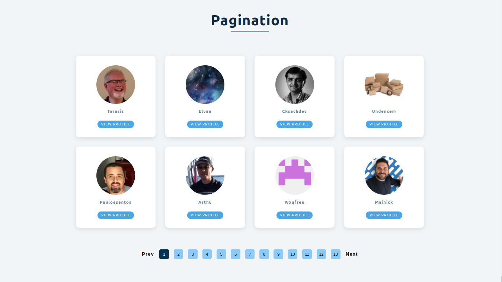

#   Pagination App

##  Introduction

*   Basic React app that displays the list of Github profiles in a sequence of pages.

*   Selected number of profiles are being displayed on a single page depending upon the selection of items per page.

##  Functional

*   The users are being navigated either forward or backward from one page to another with the click of a button.

*   Each individual profile consists of image, name of a user and link of his/her github profile.

##  Technical

*   This application is built on ReactJS.

*   Source of data :

    Github API: https://api.github.com/users/john-smilga/followers?per_page=100